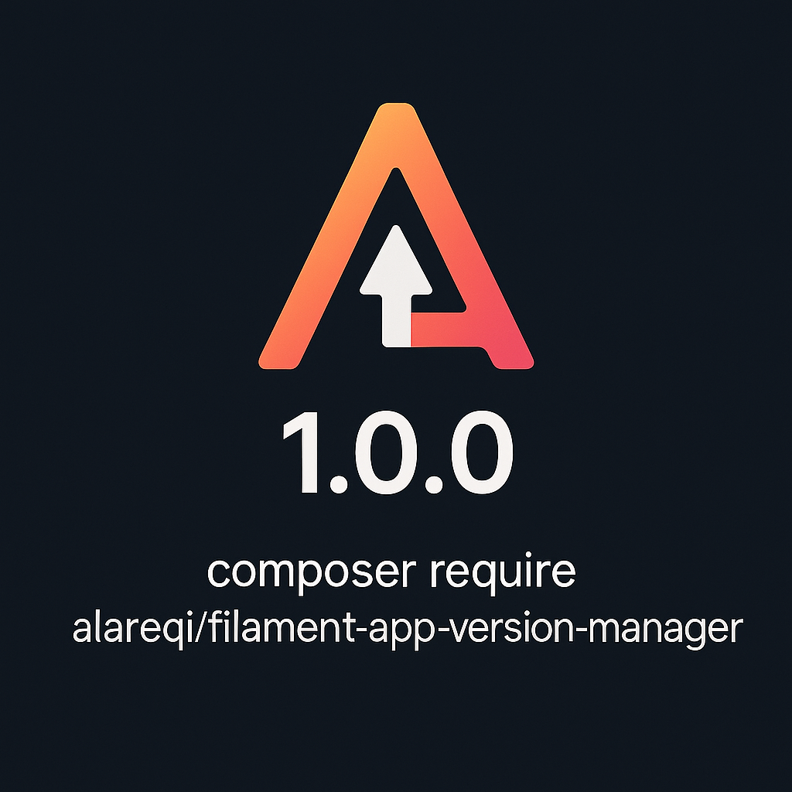

<div align="center">
    
</div>

# Filament App Version Manager

<div align="center">

[](https://packagist.org/packages/alareqi/filament-app-version-manager)
[](https://github.com/alareqi/filament-app-version-manager/actions?query=workflow%3Arun-tests+branch%3Amain)
[](https://github.com/alareqi/filament-app-version-manager/actions?query=workflow%3A"Fix+PHP+code+style+issues"+branch%3Amain)
[](https://packagist.org/packages/alareqi/filament-app-version-manager)

</div>

A comprehensive Filament plugin for managing mobile app versions with multilingual support, API endpoints, advanced configuration system, and production-ready features.

## 📚 Documentation

For comprehensive documentation, examples, and guides, visit the [**docs**](docs/) directory:

- [📖 **Complete Documentation**](docs/README.md) - Full documentation index
- [🚀 **Quick Start Guide**](docs/quick-start.md) - Get started in 5 minutes
- [📦 **Installation Guide**](docs/installation.md) - Step-by-step installation
- [⚙️ **Configuration Examples**](examples/) - Basic and advanced configuration examples

## ✨ Features

- 🚀 **Complete Version Management**: Create, edit, and manage app versions for iOS, Android, and cross-platform releases
- 🌍 **Multilingual Support**: Full localization with JSON multilingual fields and API locale support
- 📱 **Platform Support**: iOS, Android, and All platforms with Filament enum integration
- 🔄 **Version Rollback**: Built-in rollback functionality with proper validation
- 📊 **API Integration**: RESTful API endpoints with localization, caching, and rate limiting
- ⚡ **Force Updates**: Configure mandatory updates for critical releases
- 🧪 **Beta Versions**: Support for beta releases and testing
- 📈 **Metadata Support**: Store additional version metadata as JSON
- 🔒 **Audit Trail**: Track who created and updated versions with timestamps
- 🎨 **Modern UI**: Beautiful Filament interface with tabs, actions, and notifications
- ⚙️ **Advanced Configuration**: Fluent API with closure support for dynamic configuration
- 🔧 **Highly Customizable**: Override any configuration programmatically with method chaining
- 🌐 **Navigation Localization**: Proper localization support for navigation groups and labels
- 🔐 **Production Ready**: Comprehensive testing, error handling, and performance optimization

## Requirements

- PHP 8.1+
- Laravel 10.0+ or 11.0+
- Filament 3.0+

## 📦 Installation

### Step 1: Install via Composer

```bash
composer require alareqi/filament-app-version-manager
```

### Step 2: Publish Configuration

```bash
php artisan vendor:publish --tag="filament-app-version-manager-config"
```

### Step 3: Publish and Run Migrations

```bash
php artisan vendor:publish --tag="filament-app-version-manager-migrations"
php artisan migrate
```

### Step 4: Publish Translations (Optional)

```bash
php artisan vendor:publish --tag="filament-app-version-manager-translations"
```

### Step 5: Register the Plugin

Add the plugin to your Filament panel provider:

```php
use Alareqi\FilamentAppVersionManager\FilamentAppVersionManagerPlugin;

public function panel(Panel $panel): Panel
{
    return $panel
        // ... other configuration
        ->plugins([
            FilamentAppVersionManagerPlugin::make(),
        ]);
}
```

### Step 6: Quick Setup Command (Optional)

Run the setup command for guided installation:

```bash
php artisan filament-app-version-manager:install
```

This command will:
- Publish configuration files
- Publish and run migrations
- Provide setup instructions

## ⚙️ Configuration

The plugin configuration file is published to `config/filament-app-version-manager.php`. Here are the key configuration sections:

### API Configuration
```php
'api' => [
    'enabled' => true,                    // Enable/disable API endpoints
    'prefix' => 'api/version',           // API route prefix
    'middleware' => ['throttle:60,1'],   // Rate limiting middleware
    'cache_ttl' => 300,                  // Cache TTL in seconds
    'enable_stats' => false,             // Enable statistics endpoint
],
```

### Navigation Configuration
```php
'navigation' => [
    'group' => null,                     // Navigation group (null uses localized default)
    'sort' => 1,                         // Sort order in navigation
    'icon' => 'heroicon-o-rocket-launch', // Navigation icon
],
```

### Feature Flags
```php
'features' => [
    'multilingual_release_notes' => true, // Enable multilingual release notes
    'version_rollback' => true,           // Enable version rollback functionality
    'beta_versions' => true,              // Enable beta version support
    'force_update' => true,               // Enable force update functionality
    'metadata_storage' => true,           // Enable metadata storage
    'audit_trail' => true,                // Enable audit trail (created_by, updated_by)
],
```

### Localization Settings
```php
'localization' => [
    'supported_locales' => ['en', 'ar'],  // Supported locales for multilingual fields
    'default_locale' => 'en',             // Default locale for API fallback
    'fallback_locale' => 'en',            // Fallback locale when default is not available
],
```

### Validation Rules
```php
'validation' => [
    'max_version_length' => 20,           // Maximum version string length
    'max_build_number' => 99999,          // Maximum build number
    'max_release_notes_length' => 1000,   // Maximum release notes length per locale
],
```

### Default Values
```php
'defaults' => [
    'platform' => 'ios',                 // Default platform for new versions
    'is_active' => true,                  // Default active status
    'is_beta' => false,                   // Default beta status
    'force_update' => false,              // Default force update status
],
```

## 🔧 Advanced Plugin Configuration

The plugin supports a powerful fluent API with closure support for dynamic configuration. You can override any configuration value programmatically:

### Basic Fluent API Usage

```php
FilamentAppVersionManagerPlugin::make()
    ->navigationGroup('App Management')
    ->navigationSort(5)
    ->navigationIcon('heroicon-o-rocket-launch')
    ->enableApiRoutes(true)
    ->apiPrefix('api/v1/version')
    ->apiCacheTtl(600)
    ->maxVersionLength(25)
    ->defaultPlatform('ios')
    ->enableBetaVersions(false)
    ->enableForceUpdate(true)
```

### Dynamic Configuration with Closures

Closures are evaluated at runtime, enabling dynamic configuration based on environment, user context, or other runtime conditions:

```php
FilamentAppVersionManagerPlugin::make()
    // Dynamic navigation group based on user role
    ->navigationGroup(fn() => auth()->user()->isAdmin() ? 'Admin Tools' : 'App Management')

    // Environment-based API configuration
    ->enableApiRoutes(fn() => config('app.env') !== 'local')
    ->apiCacheTtl(fn() => config('app.env') === 'production' ? 3600 : 60)

    // Localized navigation group
    ->navigationGroup(fn() => __('filament-app-version-manager::app_version.navigation_group'))

    // Dynamic feature flags
    ->enableBetaVersions(fn() => config('app.debug'))
    ->enableForceUpdate(fn() => !app()->environment('testing'))

    // Complex validation rules
    ->maxVersionLength(fn() => config('app.env') === 'production' ? 20 : 50)
```

### Configuration Override Methods

All configuration values can be overridden using fluent methods:

#### Navigation Configuration
```php
->navigationGroup(string|Closure $group)
->navigationSort(int|Closure $sort)
->navigationIcon(string|Closure $icon)
```

#### API Configuration
```php
->enableApiRoutes(bool|Closure $enabled)
->apiPrefix(string|Closure $prefix)
->apiCacheTtl(int|Closure $ttl)
->enableApiStats(bool|Closure $enabled)
```

#### Feature Configuration
```php
->enableMultilingualReleaseNotes(bool|Closure $enabled)
->enableVersionRollback(bool|Closure $enabled)
->enableBetaVersions(bool|Closure $enabled)
->enableForceUpdate(bool|Closure $enabled)
->enableMetadataStorage(bool|Closure $enabled)
->enableAuditTrail(bool|Closure $enabled)
```

#### Validation Configuration
```php
->maxVersionLength(int|Closure $length)
->maxBuildNumber(int|Closure $number)
->maxReleaseNotesLength(int|Closure $length)
```

#### Default Values Configuration
```php
->defaultPlatform(string|Closure $platform)
->defaultIsActive(bool|Closure $active)
->defaultIsBeta(bool|Closure $beta)
->defaultForceUpdate(bool|Closure $forceUpdate)
```

#### Localization Configuration
```php
->supportedLocales(array|Closure $locales)
->defaultLocale(string|Closure $locale)
->fallbackLocale(string|Closure $locale)
```

### Bulk Configuration

You can also configure multiple values at once:

```php
FilamentAppVersionManagerPlugin::make()
    ->configureUsing('api.enabled', true)
    ->configureUsing('api.cache_ttl', 3600)
    ->configureWith([
        'navigation.group' => 'System',
        'navigation.sort' => 10,
        'features.beta_versions' => false,
        'validation.max_version_length' => 30,
    ])
```

## 📱 Usage

### Admin Panel

Once installed, you'll find the "App Versions" resource in your Filament admin panel. You can:

- Create new app versions with release notes in multiple languages
- Set platform-specific versions (iOS, Android, All)
- Configure force updates and beta releases
- Manage version rollbacks
- View comprehensive version history
- Export version data
- Bulk actions for managing multiple versions

### 🌐 API Endpoints

The plugin provides RESTful API endpoints for version checking and management. All endpoints support caching and rate limiting.

#### Version Check Endpoint

**POST** `/api/version/check`

Check for available updates for a specific platform and version.

**Request:**
```http
POST /api/version/check
Content-Type: application/json

{
    "platform": "ios",           // Required: "ios" or "android"
    "current_version": "1.0.0",  // Required: Current app version
    "locale": "en"               // Optional: Preferred locale for release notes
}
```

**Response:**
```json
{
    "success": true,
    "current_version": "1.0.0",
    "platform": "ios",
    "platform_label": "iOS",
    "update_available": true,
    "latest_version": "1.1.0",
    "force_update": false,
    "is_beta": false,
    "download_url": "https://apps.apple.com/app/yourapp",
    "release_date": "2025-07-01T10:00:00.000000Z",
    "release_notes": {
        "en": "Bug fixes and improvements",
        "ar": "إصلاح الأخطاء والتحسينات"
    },
    "metadata": {
        "app_size": "45.2 MB",
        "features": ["New UI", "Performance improvements"]
    },
    "checked_at": "2025-07-01T12:00:00.000000Z"
}
```

#### Localized API Responses

When a `locale` parameter is provided, the API returns localized content for that specific language:

**Request with locale:**
```http
POST /api/version/check
Content-Type: application/json

{
    "platform": "ios",
    "current_version": "1.0.0",
    "locale": "ar"
}
```

**Localized Response:**
```json
{
    "success": true,
    "current_version": "1.0.0",
    "platform": "ios",
    "platform_label": "iOS",
    "update_available": true,
    "latest_version": "1.1.0",
    "force_update": false,
    "download_url": "https://apps.apple.com/app/yourapp",
    "release_date": "2025-07-01T10:00:00.000000Z",
    "release_notes": "إصلاح الأخطاء والتحسينات",
    "checked_at": "2025-07-01T12:00:00.000000Z"
}
```

**Fallback Logic:**
- If the requested locale is not available, falls back to the default locale
- If the default locale is not available, falls back to the fallback locale
- If no locales are available, returns the first available translation
- Maintains backward compatibility when no locale is specified

**Response when no update available:**
```json
{
    "success": true,
    "current_version": "1.1.0",
    "platform": "ios",
    "platform_label": "iOS",
    "update_available": false,
    "latest_version": "1.1.0",
    "message": "You are using the latest version",
    "checked_at": "2025-07-01T12:00:00.000000Z"
}
```

**Error Response:**
```json
{
    "success": false,
    "error": "Invalid platform specified",
    "message": "Platform must be one of: ios, android, all",
    "code": 422
}
```

#### Version Stats Endpoint (Optional)

**GET** `/api/version/stats`

Get version statistics and analytics (when enabled in configuration).

**Response:**
```json
{
    "success": true,
    "total_versions": 15,
    "active_versions": 8,
    "beta_versions": 2,
    "platforms": {
        "ios": 6,
        "android": 7
    },
    "latest_versions": {
        "ios": "2.1.0",
        "android": "2.0.5"
    },
    "generated_at": "2025-07-01T12:00:00.000000Z"
}
```

#### API Configuration

Configure API behavior in your plugin registration:

```php
FilamentAppVersionManagerPlugin::make()
    ->enableApiRoutes(true)
    ->apiPrefix('api/v1/version')           // Custom API prefix
    ->apiCacheTtl(3600)                     // Cache responses for 1 hour
    ->enableApiStats(true)                  // Enable stats endpoint
    ->apiMiddleware(['throttle:100,1'])     // Custom rate limiting
```

## 🌍 Multilingual Release Notes

The plugin provides comprehensive multilingual support for release notes with a user-friendly tabbed interface.

### Configuration

Configure supported locales in your configuration file:

```php
'localization' => [
    'supported_locales' => ['en', 'ar', 'fr', 'es', 'de'],
    'default_locale' => 'en',
],
```

Or configure dynamically:

```php
FilamentAppVersionManagerPlugin::make()
    ->supportedLocales(['en', 'ar', 'fr'])
    ->defaultLocale('en')
```

### Usage in Admin Panel

When creating or editing app versions, you'll see:
- **Language Tabs**: Separate tabs for each configured locale
- **Individual Text Areas**: Dedicated textarea for each language
- **Language Labels**: Proper language names (e.g., "English", "العربية", "Français")
- **Validation**: Ensure required locales have content

### API Response

Release notes are returned as a JSON object with locale keys:

```json
{
    "release_notes": {
        "en": "Bug fixes and performance improvements",
        "ar": "إصلاح الأخطاء وتحسينات الأداء",
        "fr": "Corrections de bugs et améliorations des performances"
    }
}
```

### Programmatic Usage

Create versions with multilingual release notes:

```php
use Alareqi\FilamentAppVersionManager\Models\AppVersion;
use Alareqi\FilamentAppVersionManager\Enums\Platform;

AppVersion::create([
    'version' => '2.0.0',
    'platform' => Platform::IOS,
    'release_notes' => [
        'en' => 'Major update with new features',
        'ar' => 'تحديث كبير مع ميزات جديدة',
        'fr' => 'Mise à jour majeure avec de nouvelles fonctionnalités'
    ],
    'release_date' => now(),
    'download_url' => 'https://apps.apple.com/app/yourapp',
    'is_active' => true,
]);
```

## 🎨 Customization

### Model Relationships

If you have an Admin model, the plugin will automatically create relationships:

```php
// In your Admin model
public function createdAppVersions()
{
    return $this->hasMany(AppVersion::class, 'created_by');
}

public function updatedAppVersions()
{
    return $this->hasMany(AppVersion::class, 'updated_by');
}
```

## Database Schema

The plugin creates an `app_versions` table with the following structure:

- `id` - Primary key
- `version` - Version string (e.g., "1.0.0")
- `build_number` - Optional build number
- `platform` - Enum: ios, android, all
- `minimum_required_version` - Minimum version required
- `release_notes` - JSON multilingual field
- `release_date` - Release date
- `download_url` - App store URL
- `force_update` - Boolean flag
- `is_active` - Boolean flag
- `is_beta` - Boolean flag
- `is_rollback` - Boolean flag
- `metadata` - JSON field for additional data
- `created_by` - Foreign key to admin users
- `updated_by` - Foreign key to admin users
- `created_at` - Timestamp
- `updated_at` - Timestamp

## Translations

The plugin supports full bilingual functionality with translations for:

- English (`en`)
- Arabic (`ar`)

Translation files are located in:
- `lang/vendor/filament-app-version-manager/en/app_version.php`
- `lang/vendor/filament-app-version-manager/ar/app_version.php`

## 🧪 Testing

The plugin includes comprehensive test coverage with 50+ tests covering all functionality.

### Running Tests

```bash
# Run all tests
vendor/bin/pest

# Run tests with coverage
vendor/bin/pest --coverage

# Run specific test file
vendor/bin/pest tests/ConfigurationOverrideTest.php
```

### Creating Sample Data

Create sample app versions for testing:

```php
use Alareqi\FilamentAppVersionManager\Models\AppVersion;
use Alareqi\FilamentAppVersionManager\Enums\Platform;

// Create a basic version
AppVersion::create([
    'version' => '1.0.0',
    'platform' => Platform::IOS,
    'release_date' => now(),
    'download_url' => 'https://apps.apple.com/app/yourapp',
    'release_notes' => [
        'en' => 'Initial release with core features',
        'ar' => 'الإصدار الأولي مع الميزات الأساسية'
    ],
    'is_active' => true,
]);

// Create a beta version
AppVersion::create([
    'version' => '2.0.0-beta',
    'build_number' => '200',
    'platform' => Platform::ANDROID,
    'release_date' => now()->addWeek(),
    'download_url' => 'https://play.google.com/store/apps/details?id=com.yourapp',
    'release_notes' => [
        'en' => 'Beta version with experimental features',
        'ar' => 'نسخة تجريبية مع ميزات تجريبية'
    ],
    'is_active' => true,
    'is_beta' => true,
    'metadata' => [
        'features' => ['New UI', 'Dark mode', 'Performance improvements'],
        'known_issues' => ['Minor UI glitches in landscape mode']
    ]
]);

// Create a force update version
AppVersion::create([
    'version' => '1.5.0',
    'platform' => Platform::IOS,
    'minimum_required_version' => '1.0.0',
    'release_date' => now(),
    'download_url' => 'https://yourapp.com/download',
    'release_notes' => [
        'en' => 'Critical security update - please update immediately',
        'ar' => 'تحديث أمني مهم - يرجى التحديث فوراً'
    ],
    'is_active' => true,
    'force_update' => true,
]);
```

### Test Configuration

For testing purposes, you can override configuration:

```php
// In your test setup
config([
    'filament-app-version-manager.api.enabled' => true,
    'filament-app-version-manager.api.cache_ttl' => 60,
    'filament-app-version-manager.localization.supported_locales' => ['en', 'ar'],
]);
```

## 🔧 Troubleshooting

### Common Issues and Solutions

#### Plugin Not Appearing in Admin Panel

**Problem**: The App Versions resource doesn't appear in the Filament admin panel.

**Solutions**:
1. Ensure the plugin is registered in your panel provider:
   ```php
   ->plugins([
       FilamentAppVersionManagerPlugin::make(),
   ])
   ```

2. Clear your application cache:
   ```bash
   php artisan cache:clear
   php artisan config:clear
   php artisan view:clear
   ```

3. Ensure migrations have been run:
   ```bash
   php artisan migrate
   ```

#### API Endpoints Not Working

**Problem**: API endpoints return 404 or are not accessible.

**Solutions**:
1. Ensure API routes are enabled:
   ```php
   FilamentAppVersionManagerPlugin::make()
       ->enableApiRoutes(true)
   ```

2. Check your route cache:
   ```bash
   php artisan route:clear
   php artisan route:cache
   ```

3. Verify the API prefix in your configuration matches your requests.

#### Multilingual Release Notes Not Showing

**Problem**: Language tabs are not appearing in the form.

**Solutions**:
1. Ensure multilingual feature is enabled:
   ```php
   'features' => [
       'multilingual_release_notes' => true,
   ],
   ```

2. Configure supported locales:
   ```php
   'localization' => [
       'supported_locales' => ['en', 'ar', 'fr'],
   ],
   ```

3. Clear configuration cache:
   ```bash
   php artisan config:clear
   ```

#### Navigation Group Not Localized

**Problem**: Navigation group shows as "null" or doesn't use translations.

**Solutions**:
1. Publish and configure translations:
   ```bash
   php artisan vendor:publish --tag="filament-app-version-manager-translations"
   ```

2. Set navigation group to null in config to use localized default:
   ```php
   'navigation' => [
       'group' => null, // Uses __('filament-app-version-manager::app_version.navigation_group')
   ],
   ```

3. Or set a custom localized group:
   ```php
   FilamentAppVersionManagerPlugin::make()
       ->navigationGroup(fn() => __('custom.navigation_group'))
   ```

#### Configuration Overrides Not Working

**Problem**: Plugin configuration overrides are not taking effect.

**Solutions**:
1. Ensure you're using the correct method names and syntax:
   ```php
   FilamentAppVersionManagerPlugin::make()
       ->navigationGroup('Custom Group')  // Correct
       ->setNavigationGroup('Custom Group') // Incorrect
   ```

2. For closure-based configuration, ensure closures return the expected type:
   ```php
   ->enableApiRoutes(fn() => (bool) config('app.api_enabled'))
   ```

3. Clear all caches after configuration changes:
   ```bash
   php artisan optimize:clear
   ```

#### Database Migration Issues

**Problem**: Migration fails or tables are not created properly.

**Solutions**:
1. Ensure you have proper database permissions.

2. Check for conflicting table names:
   ```php
   // In your configuration
   'database' => [
       'table_name' => 'custom_app_versions',
   ],
   ```

3. Run migrations with verbose output:
   ```bash
   php artisan migrate --verbose
   ```

#### Performance Issues

**Problem**: Admin panel or API responses are slow.

**Solutions**:
1. Enable API caching:
   ```php
   'api' => [
       'cache_ttl' => 3600, // Cache for 1 hour
   ],
   ```

2. Add database indexes if you have many records:
   ```php
   // In a new migration
   Schema::table('app_versions', function (Blueprint $table) {
       $table->index(['platform', 'is_active']);
       $table->index(['version', 'platform']);
   });
   ```

3. Use pagination for large datasets in the admin panel.

### Debug Mode

Enable debug mode to get more detailed error information:

```php
// In your .env file
APP_DEBUG=true

// Or temporarily in your plugin configuration
FilamentAppVersionManagerPlugin::make()
    ->configureUsing('debug', true)
```

### Getting Help

If you're still experiencing issues:

1. Check the [GitHub Issues](https://github.com/alareqi/filament-app-version-manager/issues) for similar problems
2. Enable debug mode and check your Laravel logs
3. Ensure you're using compatible versions of PHP, Laravel, and Filament
4. Create a minimal reproduction case when reporting issues

## 🤝 Contributing

Contributions are welcome! Please feel free to submit a Pull Request.

### Development Setup

1. Clone the repository
2. Install dependencies: `composer install`
3. Run tests: `vendor/bin/pest`
4. Check code style: `vendor/bin/pint`

### Guidelines

- Follow PSR-12 coding standards
- Add tests for new features
- Update documentation for any changes
- Ensure all tests pass before submitting

## 📄 License

This package is open-sourced software licensed under the [MIT license](LICENSE.md).

## 💬 Support

For support, please:

1. Check this documentation first
2. Search [existing issues](https://github.com/alareqi/filament-app-version-manager/issues)
3. Create a new issue with detailed information
4. Consider sponsoring the project for priority support
